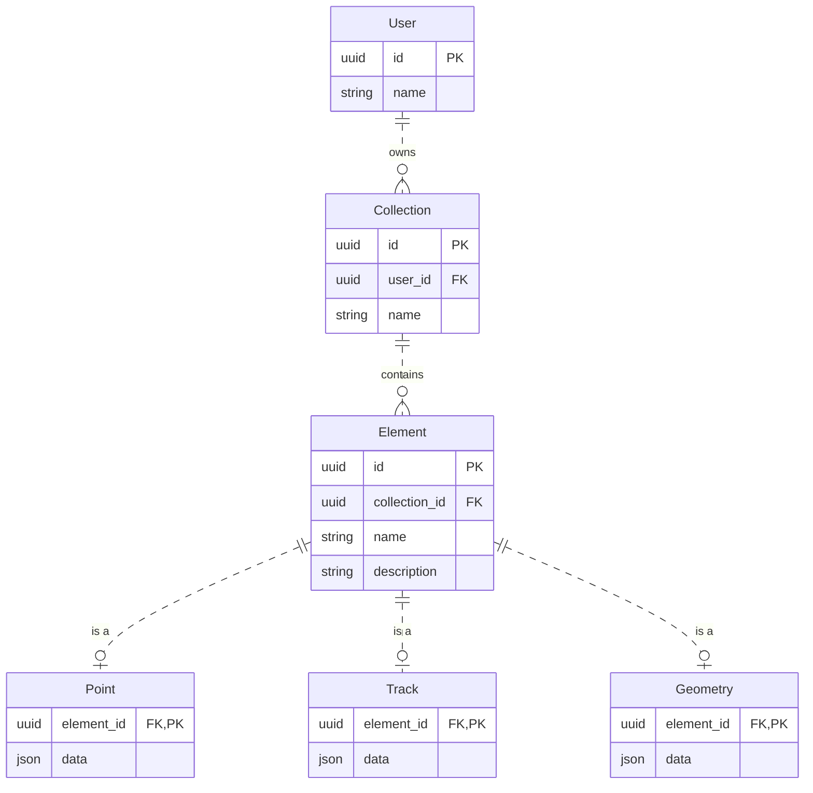

# Database

The database has the following schema.
Note that the user will be something that will be added later on

```mermaid
erDiagram
    User 1..0+ Collection: "owns"
    Collection 1..0+ Element: "contains"
    Element 1..zero or one Point: "is a"
    Element 1..zero or one Track: "is a"
    Element 1..zero or one Geometry: "is a"

    User {
        uuid id PK
        string name
    }

    Collection {
        uuid id PK
        uuid user_id FK
        string name
    }

    Element {
        uuid id PK
        uuid collection_id FK
        string name
        string description
    }

    Point {
        uuid element_id FK, PK
        json data
    }

    Track {
        uuid element_id FK, PK
        json data
    }

    Geometry {
        uuid element_id FK, PK
        json data
    }
```